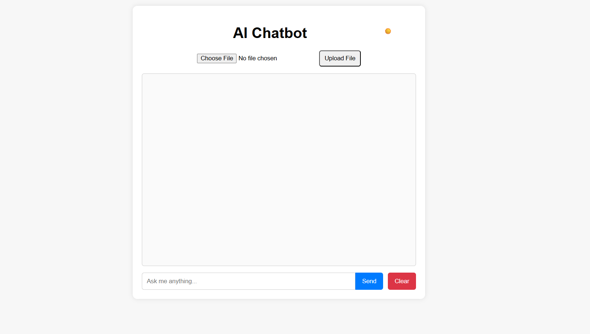
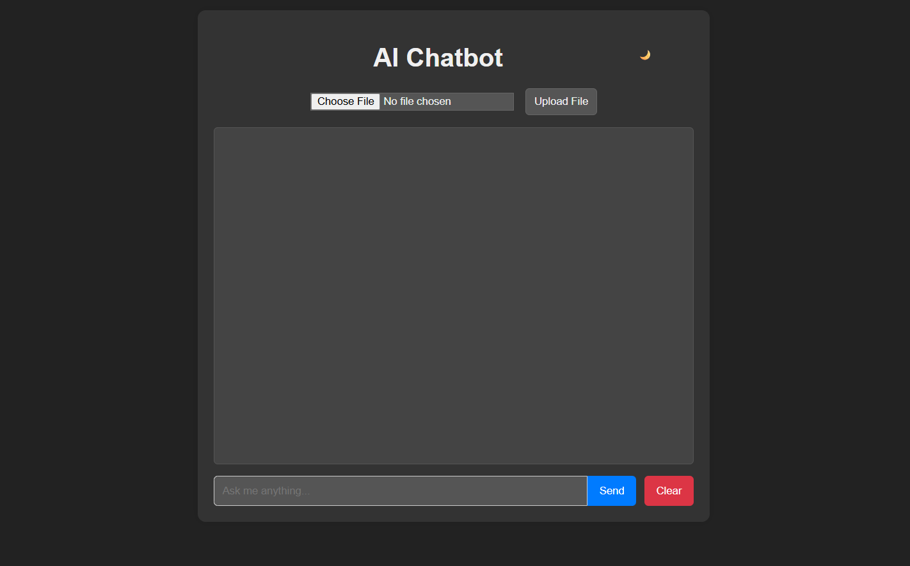
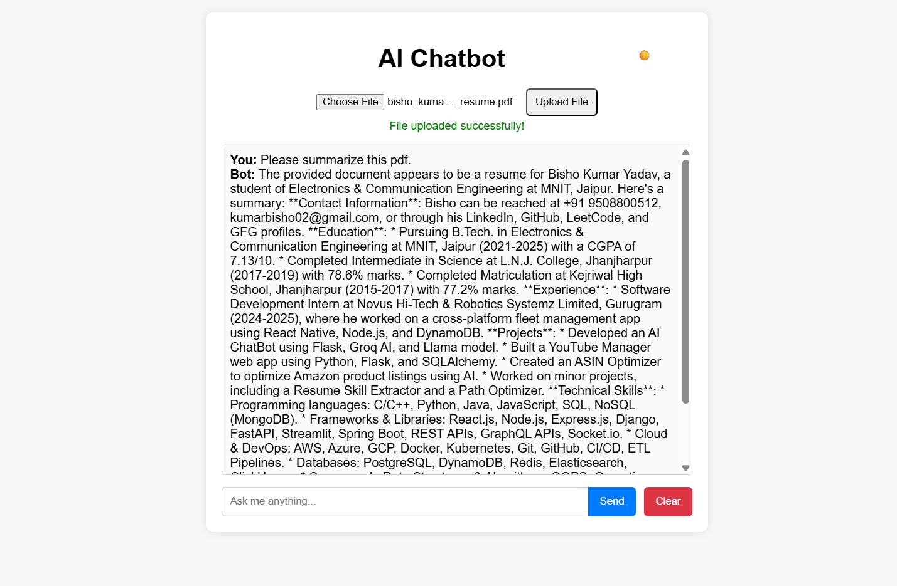
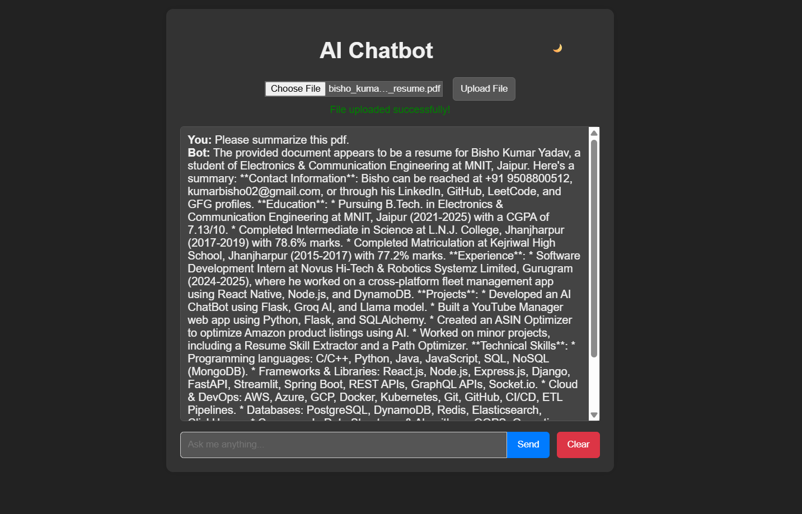

[**🟢 Live Demo**](https://ai-chatbot-1-0.onrender.com/)
[](assets/input_ui_part1.png)

# Groq AI Chatbot

An intelligent, file-aware chatbot built with Flask and Groq's Llama-3 model. Upload documents (PDF, TXT, CSV) and interact with an AI assistant that leverages your data for context-rich answers.

---

## 🚀 Features

- **Conversational AI**: Powered by Groq's Llama-3.3-70B model for fast, accurate responses.
- **File Upload**: Supports PDF, TXT, and CSV. Extracts text for context-aware chat.
- **Modern UI**: Clean, responsive interface with light/dark mode toggle.
- **Chat History**: Maintains context for multi-turn conversations.
- **Easy Deployment**: Simple setup for local or cloud hosting.

---

## 🖥️ User Interface

<p align="center">
  
  
</p>
<p align="center">
  
  
</p>

---

## ⚡ Quickstart

### 1. Clone & Setup

```powershell
git clone https://github.com/kumarBisho/AI-CHATBOT.git
cd AI-CHATBOT
python -m venv .venv; .\.venv\Scripts\Activate.ps1
pip install -r requirements.txt
```

### 2. Configure API Key

Create a `.env` file in the project root:

```
API_KEY=your_groq_api_key_here
```

### 3. Run Locally

```powershell
python app.py
```

Visit [http://localhost:5000](http://localhost:5000) in your browser.

---

## 📝 Usage

1. **Upload a file** (PDF, TXT, CSV) for context.
2. **Ask questions** in the chat box.
3. **Toggle theme** for light/dark mode.
4. **Clear chat** to reset conversation.

---

## 📦 Requirements

- Python 3.8+
- Flask
- requests
- python-dotenv
- PyPDF2
- pandas

See `requirements.txt` for details.

---

## 🌐 Deployment

- For production, use a WSGI server (e.g., Gunicorn) and secure your API key.
- `.env` is ignored by `.gitignore` for safety.

---

## 📄 License & Credits

- Built by [kumarBisho](https://github.com/kumarBisho)
- Powered by [Groq API](https://groq.com/)
- UI inspired by modern chat apps

---

<p align="center"><sub>Made with ❤️ using Flask & Groq</sub></p>
